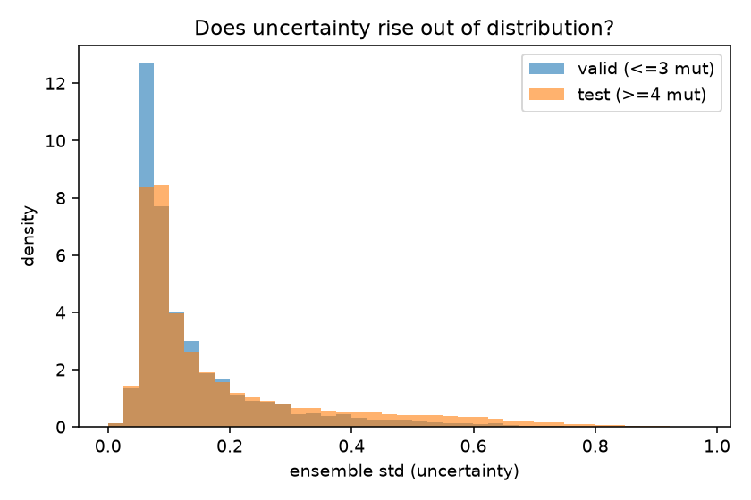
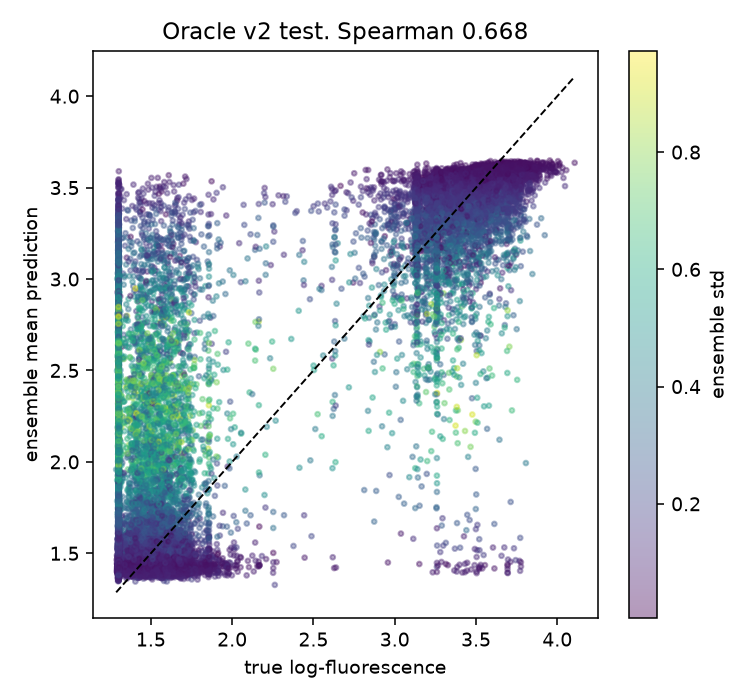

# Notes

Running log of the modeling work. Newest step at the bottom. This covers the reasoning
and the results. Setup and commands are in the READMEs.

## The setup everything depends on

GFP fluorescence, 54k point mutants of avGFP, label is `log_fluorescence`. The split
groups variants by edit distance from the wild-type: train and valid hold variants
with 3 mutations or fewer, test holds 4 or more. Train is about 82% bright and test is
about 32%. The model learns from the bright local neighborhood and is graded on the
farther, mostly-dark region it did not train on, which measures extrapolation. If train
and test are reshuffled together, near-duplicate variants land on both sides of the
boundary and the reported numbers are inflated, so the split is kept as is.

The metric is Spearman rank correlation on the test set. Downstream the oracle ranks
candidate sequences and picks the best, so rank quality matters more than absolute
error here. Protocol: train on train, select on valid, report test. Test is not used
until the final number.

## Step 2. Oracle v1: frozen ESM-2 plus a head

Use a pretrained protein language model as a fixed feature extractor rather than
training from scratch. Run every sequence through ESM-2 650M with the weights frozen,
mean-pool to one vector, cache the vectors, and train a small head on them. The
embedding pass runs once.

Two heads. Ridge as a linear baseline and a small MLP as the learned head. If Ridge
ranks about as well as the MLP, the signal is in the embeddings and the head has little
to add.

Results:
- test Spearman 0.61 (Ridge), 0.63 (MLP).
- valid Spearman about 0.71 to 0.73. The drop from valid (in-distribution) to test
  (out-of-distribution) is about 0.10. Ranking mostly holds under the shift.
- RMSE moves more. valid RMSE about 0.44 to 0.47, test RMSE about 0.84 to 0.96, close
  to double. The model ranks the far set reasonably, but its absolute predictions there
  are biased high toward the bright training mean.
- MLP beats Ridge by about 0.01 on test and about 0.05 on train. The embeddings carry
  the signal, the head is a minor lever, and the extra nonlinearity mostly fits the
  training neighborhood without transferring.

The oracle ranks the far set reasonably while its absolute predictions there are
miscalibrated. That gap is what an optimizer can later exploit.

## Step 3. Oracle v2: fine-tune plus uncertainty

Two changes aimed at v1's weakness.

Fine-tune the backbone instead of freezing it. ESM-2 150M, full fine-tune, which is the
size that trains on the Mac. Separate learning rates, smaller on the backbone (2e-5)
and larger on the head (1e-3).

Add uncertainty with a deep ensemble. Three fine-tunes from different seeds, and the
spread across their predictions is the uncertainty. This targets epistemic uncertainty
(the model's own ignorance) rather than aleatoric uncertainty (noise in the data),
since epistemic uncertainty is what grows on the out-of-distribution region and what a
step 6 optimizer would try to exploit.

Results:
- test Spearman 0.67, up from v1's 0.62. The fine-tuned 150M model outperforms the
  frozen 650M model.
- test RMSE 0.51, down from v1's 0.84 to 0.96. The absolute predictions on the far set
  are much less biased after fine-tuning.
- the extrapolation gap remains. valid Spearman 0.77, test 0.67, about a 0.10 drop.
  Fine-tuning raises the whole curve but does not remove the shift.
- calibration:
  - mean ensemble std is 0.187 on test and 0.141 on valid. The ensemble is more
    uncertain on the region it did not train on.
  - err_vs_std, the Spearman between the ensemble std and the absolute error, is 0.52
    on test and 0.39 on valid, both positive. Larger uncertainty tends to mean larger
    error, and the link is stronger on the test set.
  - the intervals are overconfident. cov68 is 0.31 to 0.40 against a target of 0.68,
    cov90 is 0.61 to 0.64 against 0.90. A three-model ensemble underestimates the size
    of the uncertainty. The direction and ranking are right, the magnitude would need
    recalibration (temperature scaling or conformal) for honest intervals.

Fine-tuning improved both the ranking and the absolute error on the far set. The
ensemble uncertainty is larger on the test set and correlates with error. That
uncertainty is what step 6 will use to hold an optimizer inside the region where the
oracle can be trusted.

## Where this is going

v1 showed the oracle is miscalibrated out of distribution. v2 is more accurate and its
uncertainty grows on the region it did not train on. Step 4 puts the oracle in a closed
loop with a proposer. Step 6 measures an optimizer exploiting the oracle's weak spots
and then reduces it with a trust region or an uncertainty penalty built on the v2
uncertainty.
